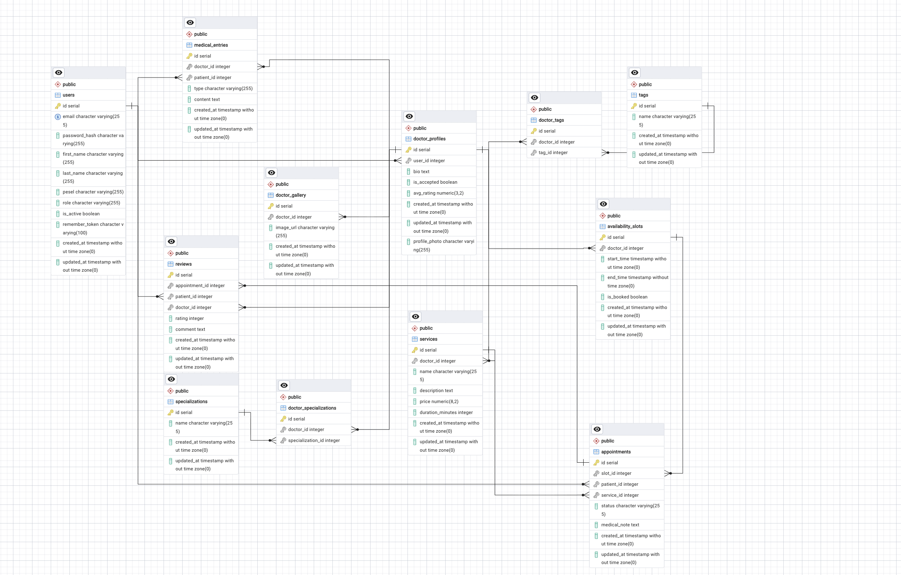
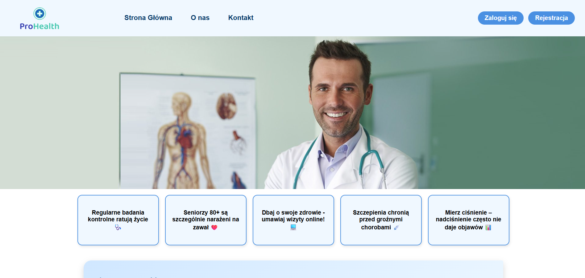
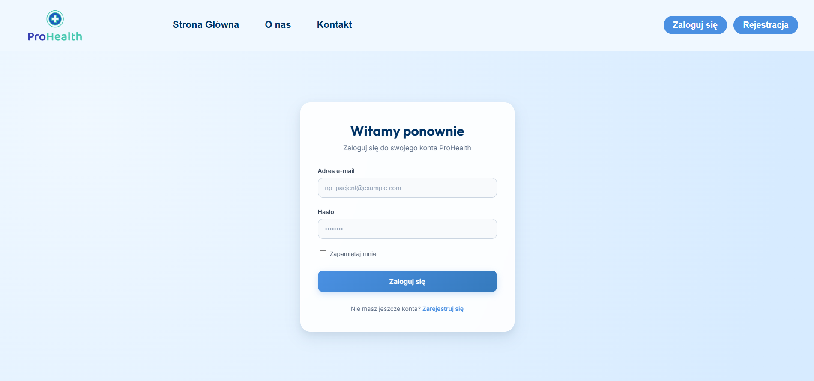
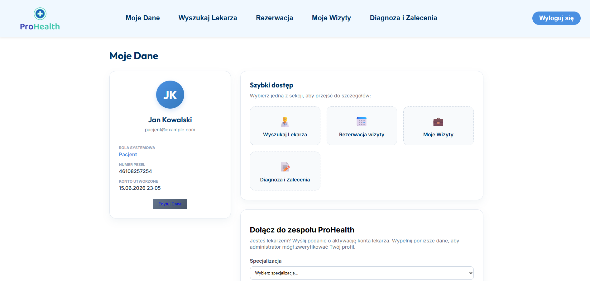
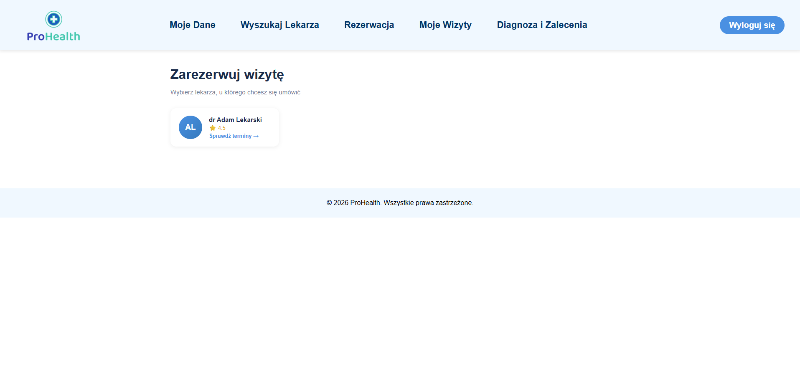
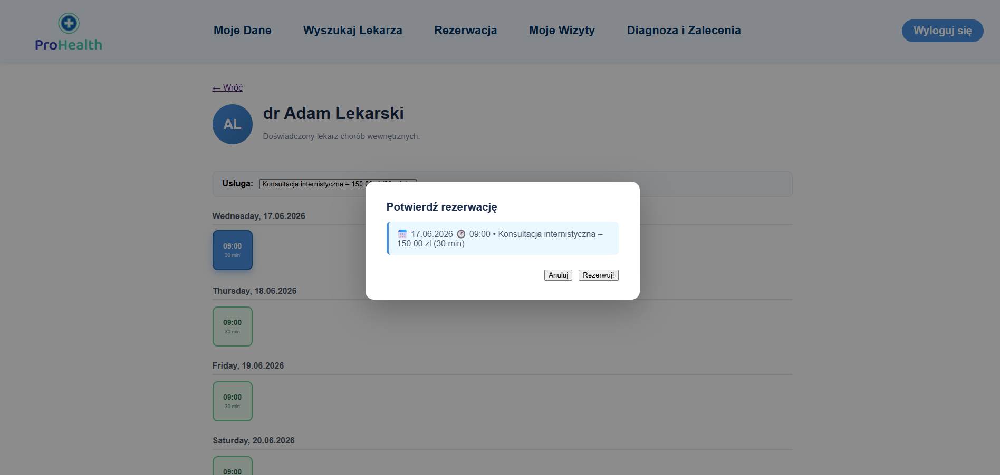
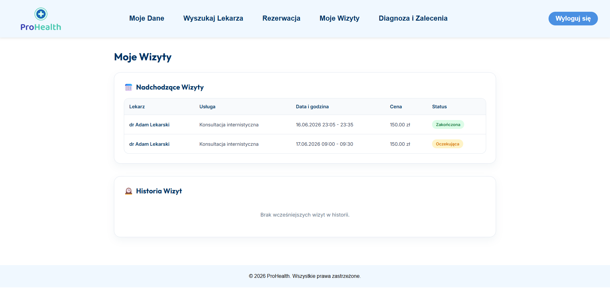
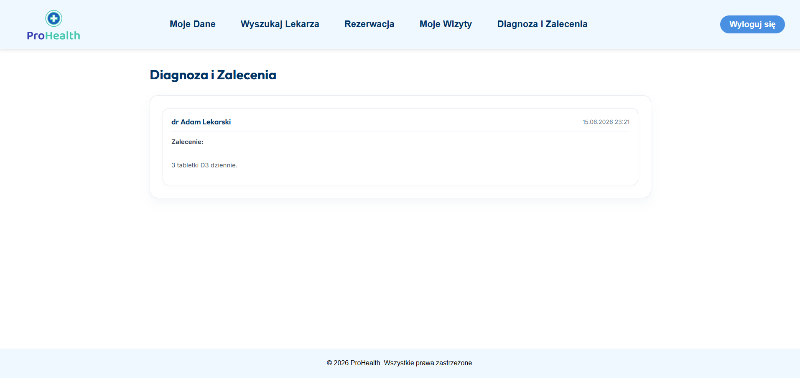

# ProHealth - System Zarządzania Przychodnią Medyczną

Kompleksowa aplikacja webowa typu full-stack przeznaczona do zarządzania placówką medyczną, automatyzująca procesy rezerwacji wizyt, zarządzania grafikami lekarzy oraz obsługi pacjentów. Modyfikowanie podstron za pomocą WYSIWYG.

---

## Spis treści
1. [Autorzy i podział ról](#1-autorzy-i-podział-ról)
2. [Użyte technologie](#2-Użyte-technologie)
3. [Przeznaczenie aplikacji](#3-przeznaczenie-aplikacji)
4. [Opis funkcjonalności](#4-opis-funkcjonalności)
    * [Panel Pacjenta](#panel-pacjenta)
    * [Panel Administratora](#panel-administratora)
    * [Panel Lekarza](#panel-lekarza)
5. [Schemat ERD (Entity Relationship Diagram)](#5-schemat-erd-entity-relationship-diagram)
6. [Dalszy rozwój](#6-dalszy-rozwój)
7. [Instrukcja uruchomienia aplikacji krok po kroku](#7-instrukcja-uruchomienia-aplikacji-krok-po-kroku)
8. [Reprezentatywny przebieg użytku aplikacji](#8-reprezentatywny-przebieg-użytku-aplikacji)

---

## 1. Autorzy i podział ról

* **[Kacper Łazorczyk]**
  * System logowania i rejestracji.
  * Implementacja bazy danych.
  * Strona główna, WYSIWYG.
  * Sekcja najlepsi lekarze.
  * Wyszukiwarka i filtry.
  * Profil Pacjenta.

* **[Kacper Popowicz]**
  * Profil Lekarza.
  * Zarządzanie wizytami.
  * Panel administratora.
  * Podsumowanie wizyt.
  * Proces rezerwacji.

---

## 2. Użyte technologie

Aplikacja została przygotowana bez użycia zewnętrznych bibliotek komponentów oraz gotowych szablonów.

* **Backend:** PHP 8.4, Laravel Framework 13
* **Frontend:** Vanilla HTML5, Custom CSS3
* **Baza danych:** PostgreSQL 15
* **Środowisko:** Docker, Docker Compose

---

## 3. Przeznaczenie aplikacji

`ProHealth` rozwiązuje problem czasochłonnej, telefonicznej rejestracji pacjentów oraz trudności w zarządzaniu grafikami lekarzy wielu specjalizacji. Aplikacja kierowana jest do małych i średnich przychodni zdrowia, które potrzebują niezależnego, bezpiecznego i szybkiego systemu do obsługi wewnętrznej oraz udostępnienia pacjentom panelu rezerwacji online 24/7.

---

## 4. Opis funkcjonalności

### Panel Pacjenta
* Rejestracja i logowanie do systemu.
* Przegląd profili lekarzy (specjalizacje, opisy, oceny).
* Rezerwacja wolnych terminów wizyt w czasie rzeczywistym.
* Historia odbytych oraz lista nadchodzących wizyt.
* System wystawiania recenzji i ocen lekarzom.

### Panel Administratora
* Pełny moduł **CRUD** zarządzania bazą lekarzy i pacjentów.
* Przegląd i moderacja opinii wystawionych przez pacjentów.
* Modyfikacja stron WYSIWYG.
* Dodawanie specjalizacji.

### Panel Lekarza
* Definiowanie i modyfikowanie harmonogramu pracy(dni, godziny przyjęć).
* Dodanie zdjęć do galeri.
* Dodawanie tagów, spejalizacji.
* Wystawianie zaleceń/diagnozy.

---

## 5. Schemat ERD (Entity Relationship Diagram)

Poniższy schemat przedstawia strukturę relacyjnej bazy danych PostgreSQL.





## 6. Dalszy rozwój
* Projekt mógł by zostać rozwinięty o logistykę zarządzania kilkoma takimi przychodniami.
* Warto by było wdrożyć system powiadomień SMS, e-mail.
* Dodanie płatności online.


## 7. Instrukcja uruchomienia aplikacji krok po kroku

### Wymagania wstępne
* Zainstalowany **Docker** oraz **Docker Compose**.

### Uruchomienie projektu

1. **Sklonuj repozytorium:**
   ```bash
   git clone https://github.com/lkacper0/Projekt-Zarzadzanie-Przychodnia
   cd .\Projekt-Zarzadzanie-Przychodnia\


2. **Przygotuj plik środowiskowy:**
    ```bash
    cp .env.example .env
* upewnij sie, że kofiguracja bazy danych w .env wygląda następująco:

    ```bash
    DB_CONNECTION=pgsql
    DB_HOST=db
    DB_PORT=5432
    DB_DATABASE=przychodnia
    DB_USERNAME=postgres
    DB_PASSWORD=postgres


3. **Uruchom kontenery Dockera:**
    ```bash
    docker compose up -d --build

4. **Generowanie klucza API:**
    ```bash
    docker compose run --rm laravelapp php artisan key:generate

5. **Uruchom migracje bazy danych wraz z zasileniem danymi (Seeding):**
    ```bash
    docker compose exec laravelapp php artisan migrate --seed

6. **Dostęp do aplikacji:**
    * Otwórz przeglądarkę i wejdź pod adres: http://localhost:8000


## 8. Reprezentatywny przebieg użytku aplikacji

### 1.
Główny strona, którą widzimy pod domyślnym adresem: http://localhost:8000, żeby się zalogować wystarczy, kliknąć w prawym górnym rogu strony, przycisk "zaloguj się".


### 2.
Panel logowania, użytkownik może się tu zalogować, lub zarejestrować jak nie ma jeszcze konta.


### 3.
Podstawowy panel pacjenta. Z jego poziomu, możemy wybrać sobie co chcemy zrobić. Wybieramy Rezerwacje.


### 4.
Teraz możemy wybrać do jakiego lekarza, chcemy się zapisać.


### 5.
Po wybraniu lekarza, widzimy dostępne sloty czasowe, wybierając uprzednio jedną z dostępnych usług od lekarza, klikając wybrany slot, możemy się zapisać na wizyte w przedstawionym przedziale czasowym.


### 6.
W zakładce "Moje Wizyty", widzimy nadchodzące wizyty i ich historie.


### 7.
Klikając w "Diagnoza i Zalecenia", otwiera nam się podstrona z wpisanymi przez lekarza, zaleceniami lub diagnozami.



## 9. Dane testowe
### Dane kont testowych (Seeder)
Po uruchomieniu seedera możesz zalogować się na następujące konta testowe:
* **Administrator:** `admin@prohealth.pl` - hasło: `password`
* **Lekarz:** `lekarz@prohealth.pl` - hasło: `password`
* **Pacjent:** `pacjent@prohealth.pl` - hasło: `password`